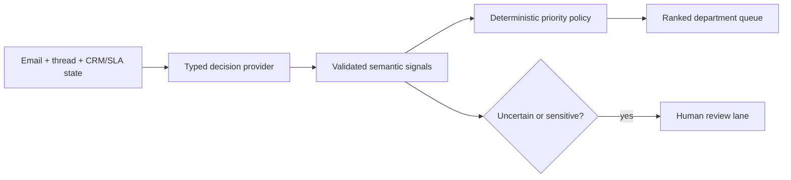

# MailOrdinal

**A decision-native enterprise inbox. Typed model signals in; deterministic queue order out.**

MailOrdinal is an open-source reference implementation for a new kind of software:
**probabilistic selection systems**. Instead of asking an AI model to produce a final,
opaque priority label, MailOrdinal decomposes an inbound email into atomic judgments and
combines them with exact operational metadata in ordinary code.

The inbox is the first vertical. The underlying pattern applies to tickets, incidents,
claims, applications, approvals, and any other queue where unstructured state must become
a controlled selection.

> [!IMPORTANT]
> MailOrdinal is independent and is not affiliated with or endorsed by TypeSafe AI. The
> optional live provider uses the documented Jev API. The public demo policy is clearly
> labelled and never represented as model output.

## The product thesis

Arrival time is a poor proxy for business priority. A message should move up the queue
because a customer is blocked, a reply is owed, a deadline exists, or delay has material
impact—not simply because it arrived five minutes ago.

MailOrdinal keeps three responsibilities separate:



1. **The model judges meaning.** Is a reply expected? Is the customer blocked? Which
   department owns the next step?
2. **Code owns policy.** SLA progress, account tier, thresholds, weights, review rules, and
   final rank remain explicit and testable.
3. **Humans own ambiguity.** Low routing confidence and consequential uncertainty trigger
   review; they never silently lower priority.

## What it does

- Ranks the inbox from highest to lowest operational priority.
- Routes each message across Sales, Support, Finance, People, Legal, Partnerships, or
  General.
- Evaluates nine typed questions in one shared decision request.
- Separates reply duty from internal action duty.
- Surfaces full option distributions rather than hiding them behind one label.
- Derives priority from semantic signals, SLA age, and account tier in deterministic code.
- Explains every score through an inspectable factor ledger.
- Routes uncertain or sensitive messages to a human-review lane.
- Ships with a transparent local demo policy and an optional live Jev provider.
- Keeps provider credentials server-side and validates every response before use.

## Why this is more than email classification

A classifier says what an email resembles. A selection system decides where limited
attention should go next under uncertainty.

MailOrdinal deliberately does **not** ask a model “How urgent is this?” The final rank is a
business decision composed from narrower evidence:

| Signal                   | Owner                  | Maximum points |
| ------------------------ | ---------------------- | -------------: |
| Reply required           | Decision provider      |             15 |
| Internal action required | Decision provider      |             15 |
| Customer blocked         | Decision provider      |             18 |
| Repeated follow-up       | Decision provider      |             10 |
| Supported time window    | Decision provider      |             12 |
| Impact of delay          | Decision provider      |             15 |
| SLA consumption          | Deterministic metadata |             10 |
| Account tier             | Deterministic metadata |              5 |

The result is a transparent 100-point policy that can change without retraining or asking a
model to reinterpret company policy.

## Decision questions

The live integration submits one shared state and nine questions:

- `department` — Choice
- `reply_required` — Noul
- `action_required` — Noul
- `message_type` — Choice
- `customer_blocked` — Noul
- `is_follow_up` — Noul
- `time_window` — Choice
- `delay_impact` — Score
- `sensitivity` — Choice

The request contract lives in
[`src/domain/questions.ts`](./src/domain/questions.ts). The provider adapter lives in
[`src/lib/jev/provider.ts`](./src/lib/jev/provider.ts). No API key or provider call exists in
browser code.

## Run locally

Requirements:

- Node.js 24+
- npm 11+

```bash
npm install
cp .env.example .env.local
npm run dev
```

Open [http://localhost:3000](http://localhost:3000).

The default environment is a fully functional demo using a transparent local policy. Its
results are marked `demo` in the UI and response envelope.

### Enable the live Jev provider

Create an API key through TypeSafe AI, review its terms and data policies, then set:

```dotenv
TYPESAFE_API_KEY=your_server_side_key
TYPESAFE_MODEL=jev-latest
MAILORDINAL_PROVIDER=jev
```

Restart the server. Never prefix the key with `NEXT_PUBLIC_`.

MailOrdinal calls the documented endpoint directly:

```text
POST https://api.typesafe.ai/v1/systemone
Authorization: Bearer <server-side key>
```

See the official [TypeSafe API reference](https://docs.typesafe.ai/api) and the detailed
[integration notes](./docs/JEV_INTEGRATION.md).

## Quality gates

```bash
npm run format:check
npm run lint
npm run typecheck
npm test
npm run build
```

Run the complete gate with `npm run quality`. GitHub Actions executes the same checks on
every push and pull request.

## Architecture map

```text
src/
├── app/
│   ├── api/analyze/route.ts      # bounded, same-origin server boundary
│   └── page.tsx                  # server entrypoint
├── components/inbox/             # responsive decision workspace
├── data/demo-mails.ts            # synthetic, non-sensitive showcase data
├── domain/
│   ├── questions.ts              # nine atomic provider questions
│   ├── priority-policy.ts        # deterministic ranking and review policy
│   └── evaluate-mail.ts          # stable composition boundary
└── lib/
    ├── jev/provider.ts            # live server-only API adapter
    ├── jev/schema.ts              # strict request/response validation
    └── security/rate-limit.ts     # lightweight local abuse guard
```

Read the deeper documents:

- [System architecture](./docs/ARCHITECTURE.md)
- [Priority and review policy](./docs/DECISION_POLICY.md)
- [Jev integration contract](./docs/JEV_INTEGRATION.md)
- [Security and privacy model](./docs/SECURITY_AND_PRIVACY.md)

## Production posture

The repository is a production-minded reference, not a complete hosted mail service.
Before handling real enterprise email, add:

- authenticated users and tenant isolation;
- a distributed rate limiter;
- encrypted persistence and retention controls;
- Microsoft Graph or Gmail ingestion with least-privilege scopes;
- organization-specific calibration and acceptance tests;
- audit export, regional hosting, DPA, and incident procedures.

Attachments are intentionally not sent to the provider. A production connector should
extract permitted text in a controlled preprocessing stage.

## Responsible branding and licensing

The MailOrdinal source code is available under the [MIT License](./LICENSE). Third-party
services remain governed by their own agreements. See [NOTICE.md](./NOTICE.md) for brand,
service, and preliminary name-clearance notes.

## Contributing

Contributions are welcome. Read [CONTRIBUTING.md](./CONTRIBUTING.md) and the
[Code of Conduct](./CODE_OF_CONDUCT.md) before opening a pull request. Security issues
should follow [SECURITY.md](./SECURITY.md), not a public issue.
